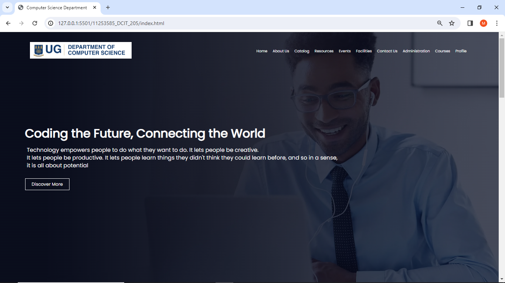
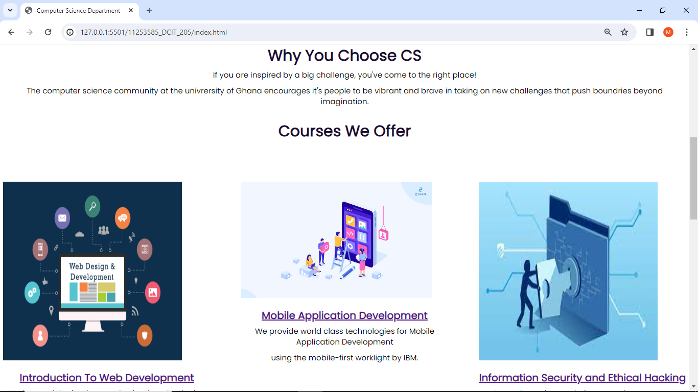
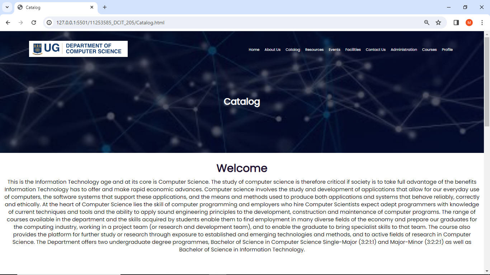
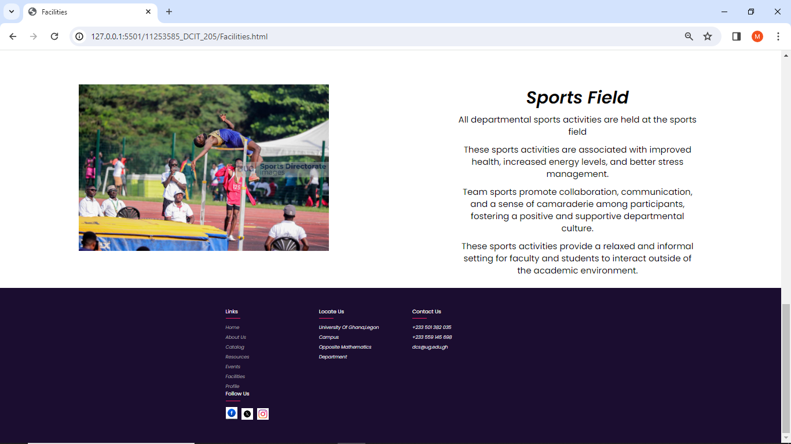

# DCIT_205_IA
# NAME: Bernard Mensah Afful
# ID: 11253585
# INTRODUCTION

Welcome to the _README_ for our school departmental website project! This document provides a brief overview of the project, its purpose, and key information for developers, administrators, and anyone else involved in the development and maintenance of the departmental school website.This project was built using only HTML and CSS.

## Purpose
The purpose of this project  was to build a user-friendly and navigable website for our Computer Science department.

# 2. How To Clone And Setup The Project
_Here is a detailed instructions on how to setup the project_

## Clone the repository
-Open a terminal or command prompt and run the following command to clone the repository
-git clone https://github.com/your-username/11253585_DCIT205.git
-Replace "your-username" with your GitHub username.

## Navigate to the Project Directory
-Change into the project directory
-cd 11253585_DCIT205

## Install Dependencies
-Run the following command to install the project dependencies:
-npm install

## Set Up Environment Variables
-Check if there's a file named '.env.example' in the project root. If it exists, duplicate it and rename the copy to '.env.' Open the '.env' file and configure any necessary environment variables, such as API keys or database connection strings.

## Run the Development Server
-Start the development server with the following command:
-npm start
-This will launch the development server, and you should see output indicating that the server is running. The website will be accessible at http://localhost:3000 by default.

## Access The School Website
-Open your web browser and navigate to http://localhost:3000. You should see the school website running locally.

# Screenshot of The Pages On The Website

**_I have learnt quite alot from this project_**
-This project has enhances my programming skills, particularly in languages such as HTML and CSS.
-I have learnt implementing responsive design principles to ensure the website functions well on various devices and screen sizes.
-I have learnt techniques for optimizing website performance, including image optimization, code minification, and caching.

